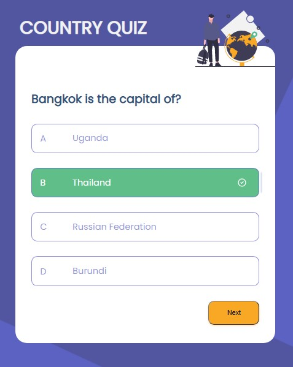

# Country Quiz

**Icon**: https://google.github.io/material-design-icons/

**API**: https://restcountries.eu/

**Design** : https://www.figma.com/file/Gw0ZNBbYN8asqFlZWy3jG1

**Live app** : https://country-quiz-app.netlify.app/

**My app** : https://country-quiz-tantely.netlify.app/

<h1 align="center">Country quiz</h1>

<div align="center">
  <h3>
    <a href="https://country-quiz-tantely.netlify.app/">
      Demo
    </a>
    <span> | </span>
    <a href="https://github.com/starjardin/country-quiz">
      Solution
    </a>
  </h3>
</div>

<!-- TABLE OF CONTENTS -->

## Table of Contents

-   [Overview](#overview)
-   [Built With](#built-with)
-   [How to use](#how-to-use)
-   [Contact](#contact)
-   [Descrition](#acknowledgements)

<!-- OVERVIEW -->

## Overview





-   You can see my demo in the following link 
    <a href="https://country-quiz-tantely.netlify.app/">
      Work Demo
    </a>. The project was fun to play with, I loved it. Most of the users stories are accomplished. You can see already the questions are displayed as well as the answers. You can also choose an answer for each question. I went a bit for an extra mile I added some sound when the users click and answer, I wanted to experiment, I also added one state that closes and opens the game.

-   My experience was when I was working out a big statement, I needed to break it down into as small as possible parts. It is much easier to handle it little by little. Figuring out what the app does is very important before you dive into coding.

-   Well, This has been a lot of fun, I learned using custom hooks which I am happy with. I also learned to use proptypes but so far it's still blury but I am sure in long time of practice it will come easely.

-   One thing I think is a wisdom that I would like to share is : it is very crucial to have a general idea about what the app is doing and start to break big problems to smaller once before diving into coding. No matter how tough it is, break the big problems down into as small parts as possible before tackling them. If you have a good base the likelyhood of having a good end is very heigh.

### Built With


-   [React](https://reactjs.org/)
-   [Styled components](https://reactjs.org/)
-   [sass](sass-lang.com)

## How To Use
<!-- Example: -->

To clone and run this application, you'll need [Git](https://git-scm.com) and [Node.js](https://nodejs.org/en/download/) (which comes with [npm](http://npmjs.com)) installed on your computer. From your command line:

```bash
# Clone this repository
$ git clone https://github.com/your-user-name/your-project-name

# Install dependencies
$ npm install

# Run the app
$ npm start
```
## Contact

-   GitHub [@starjardin](https://github.com/starjardin)

## Description

The main purpose of this app is for practicing react (react hooks). This is a challenge from <a href="https://devChallenges.io">devChallenges.io</a> for front-end developers to boost their knowledge and their tool belt for their future. 