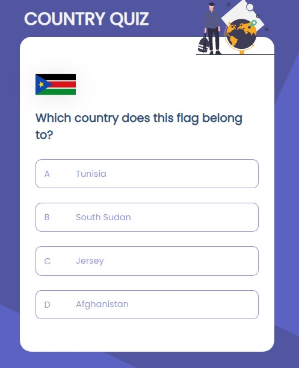

# Country Quiz

**Icon**: https://google.github.io/material-design-icons/

**API**: https://restcountries.eu/. Use data from the API to create questions and answers.

**Design** : https://www.figma.com/file/Gw0ZNBbYN8asqFlZWy3jG1

**Live app** : https://country-quiz-app.netlify.app/

<h1 align="center">{Your project name}</h1>

<div align="center">
  <h3>
    <a href="https://country-quiz-tantely.netlify.app/">
      Demo
    </a>
    <span> | </span>
    <a href="https://github.com/starjardin/country-quiz">
      Solution
    </a>
  </h3>
</div>

<!-- TABLE OF CONTENTS -->

## Table of Contents

-   [Overview](#overview)
    -   [Built With](#built-with)
-   [Features](#features)
-   [How to use](#how-to-use)
-   [Contact](#contact)
-   [Acknowledgements](#acknowledgements)

<!-- OVERVIEW -->

## Overview




Introduce your projects by taking a screenshot or a gif. Try to tell visitors a story about your project by answering:

-   You can see my demo in the following link 
    <a href="https://country-quiz-tantely.netlify.app/">
      Work Demo
    </a>?
-   What was your experience?
-   Well, This has been the funnest project ever, I learned using custom    hooks which I am happy with to know a litle bit about it. I also learned to use proptypes but so far it's still blury but I am sure in long time of proctice it will come
-   Wisdom that I would like to share is that, it is very crucial to have a general idea about what the app is doing and start to break big problems to smaller once. No matter hoe tough it is, break the big problem as small as possible before tackling them.

### Built With

<!-- This section should list any major frameworks that you built your project using. Here are a few examples.-->

-   [React](https://reactjs.org/)

## Features

<!-- List the features of your application or follow the template. Don't share the figma file here :) -->

## How To Use

<!-- Example: -->

To clone and run this application, you'll need [Git](https://git-scm.com) and [Node.js](https://nodejs.org/en/download/) (which comes with [npm](http://npmjs.com)) installed on your computer. From your command line:

```bash
# Clone this repository
$ git clone https://github.com/your-user-name/your-project-name

# Install dependencies
$ npm install

# Run the app
$ npm start
```

## Acknowledgements

<!-- This section should list any articles or add-ons/plugins that helps you to complete the project. This is optional but it will help you in the future. For example: -->

## Contact

-   Website [your-website.com](https://{your-web-site-link})
-   GitHub [@your-username](https://github.com/starjardin)
-   Twitter [@your-twitter](https://{twitter.com/your-username})
